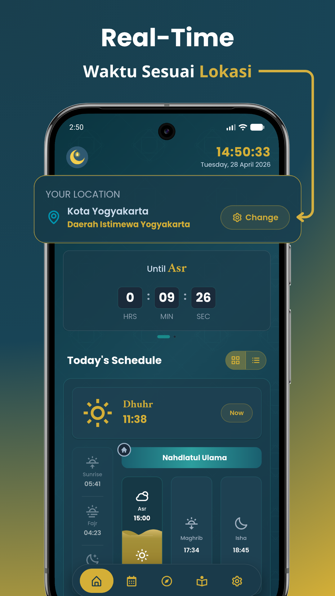
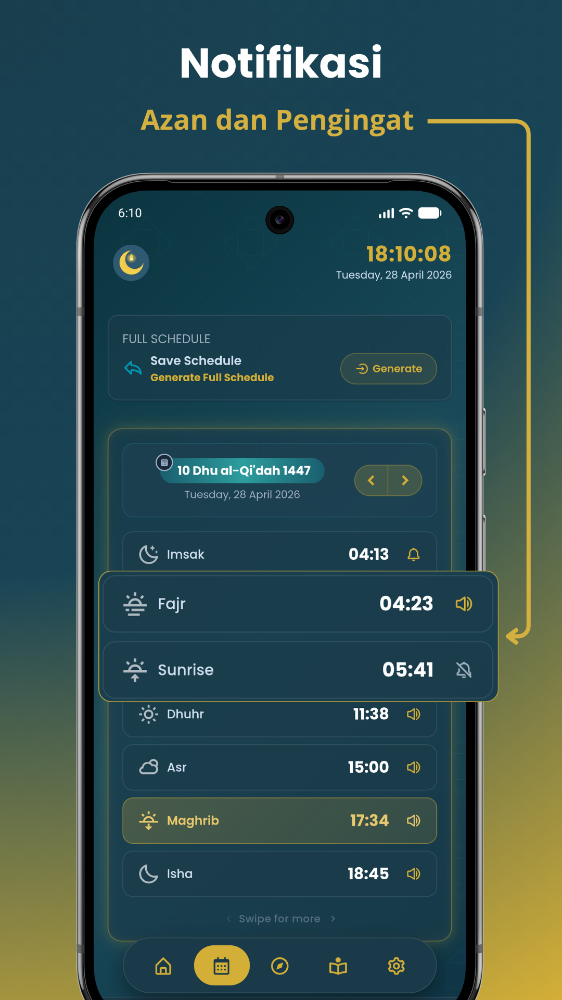
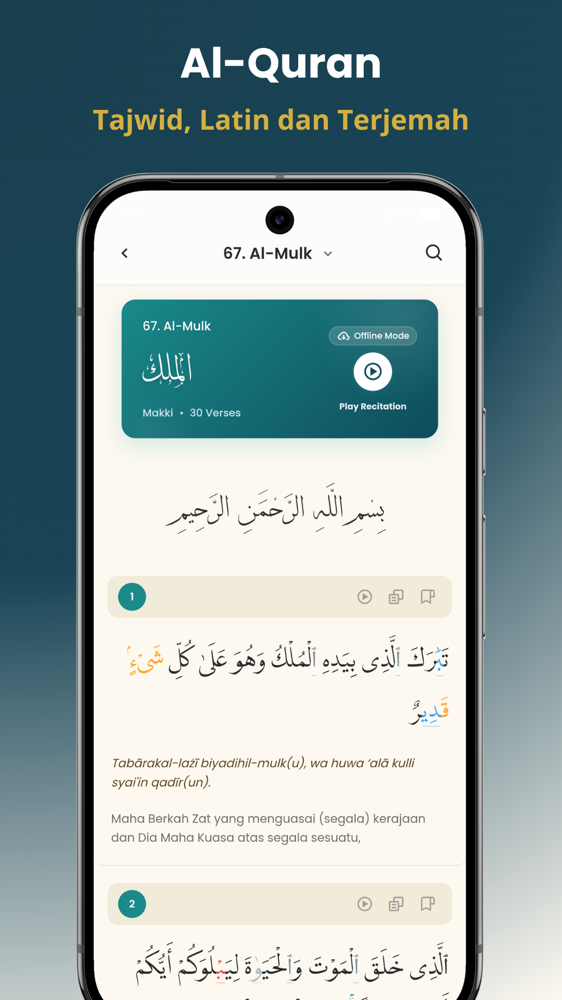
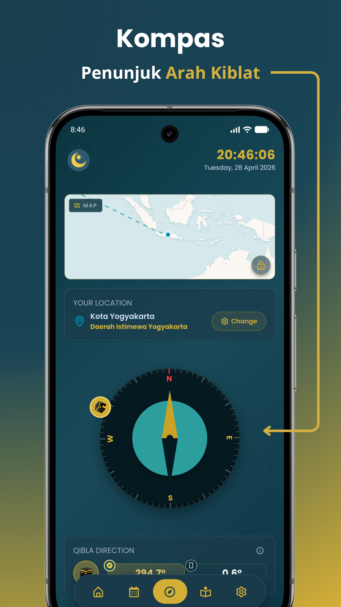
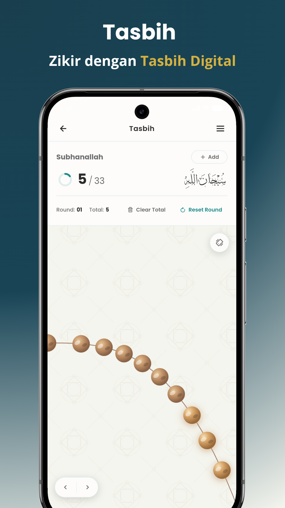
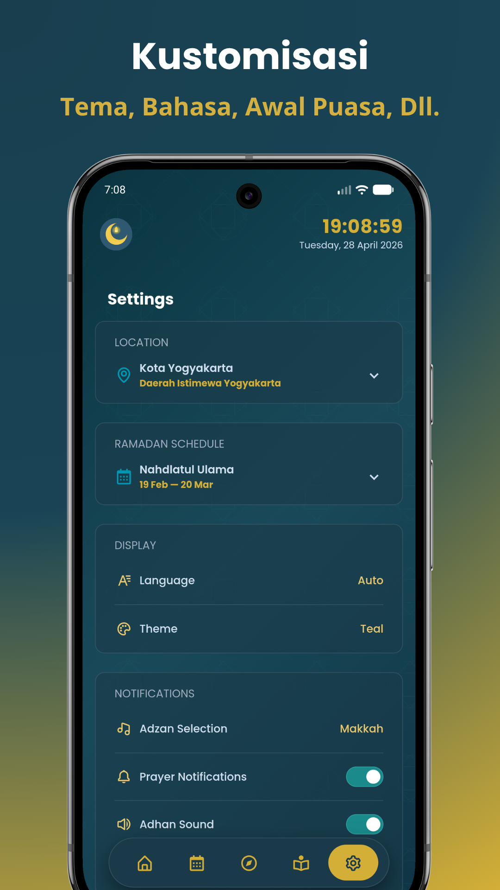

<div align="center">


# Satu Ramadhan

**Pendamping ibadah Islam yang lengkap, privat, dan gratis.**

Waktu shalat akurat · Al-Quran Tajwid · Kiblat · Tasbih Digital · Adzan

<br/>

[](https://play.google.com/store/apps/details?id=com.saturamadhan.mobile)
[](https://saturamadhan-web.pages.dev/)
[](https://saturamadhan.pages.dev/)

<br/>

[](package.json)
[](https://play.google.com/store/apps/details?id=com.saturamadhan.mobile)
[](LICENSE)
[](https://vitejs.dev/)
[](https://capacitorjs.com/)

</div>

---

## ✨ Fitur Utama

<table>
  <tr>
    <td width="50%" valign="top">
      <h3>🕌 Waktu Shalat Real-Time</h3>
      <p>Waktu shalat akurat berdasarkan GPS. Mendukung metode NU, Muhammadiyah, dan berbagai mazhab lainnya. Dilengkapi countdown real-time ke shalat berikutnya.</p>
      
    </td>
    <td width="50%" valign="top">
      <h3>🔔 Adzan & Notifikasi</h3>
      <p>Notifikasi Adzan otomatis setiap waktu shalat. Pilih suara Adzan dari Makkah, Madinah, dan lainnya. Jadwal Imsakiyah siap cetak satu bulan penuh (hijriah - masehi).</p>
      
    </td>
  </tr>
  <tr>
    <td width="50%" valign="top">
      <h3>📖 Al-Quran, Tajwid, Latin & Terjemah</h3>
      <p>Al-Quran 30 Juz lengkap dengan Tajwid berwarna otomatis, transliterasi Latin, terjemahan Bahasa Indonesia dan Inggris, serta audio murottal per ayat.</p>
      
    </td>
    <td width="50%" valign="top">
      <h3>🧭 Kompas Kiblat Live</h3>
      <p>Arah Kiblat presisi berbasis sensor perangkat dengan kompas magnetometer dan peta interaktif rute ke Ka'bah. Menampilkan derajat arah secara real-time.</p>
      
    </td>
  </tr>
  <tr>
    <td width="50%" valign="top">
      <h3>📿 Tasbih Digital</h3>
      <p>Tasbih digital elegan dengan animasi manik-manik 3D yang realistis. Lacak sesi zikir harian, atur target hitungan dan putaran, lengkap dengan kaligrafi Arab, efek getar dan suara klik.</p>
      
    </td>
    <td width="50%" valign="top">
      <h3>⚙️ Kustomisasi Penuh</h3>
      <p>Tema tampilan (Teal/Dark), bahasa (ID/EN), metode hisab (organisasi), dan pilihan suara Adzan atau hanya notifikasi semuanya bisa disesuaikan sesuai preferensi.</p>
      
    </td>
  </tr>
</table>

---

## 🛡️ Privasi by Design

> Satu Ramadhan dibangun dengan prinsip **zero data collection**.

- ✅ **Tanpa akun** — tidak ada registrasi, tidak ada login
- ✅ **Tanpa iklan** — tidak ada SDK iklan atau tracking pihak ketiga
- ✅ **Tanpa server** — semua preferensi disimpan lokal di perangkat
- ✅ **GPS aman** — koordinat hanya dipakai untuk hitung waktu shalat dan arah kiblat, tidak pernah disimpan

---

## 🧰 Tech Stack

| Layer                  | Teknologi                                                        |
| ---------------------- | ---------------------------------------------------------------- |
| **Build Tool**         | [Vite 8](https://vitejs.dev/)                                    |
| **Native Bridge**      | [Capacitor 8](https://capacitorjs.com/) + Android                |
| **Waktu Shalat**       | [Adhan.js](https://github.com/batoulapps/adhan-js) + Aladhan API |
| **Peta / Kiblat**      | [Leaflet.js](https://leafletjs.com/) + Geomagnetism              |
| **Al-Quran Mushaf**    | [PageFlip](https://nodlik.github.io/StPageFlip/) + PanZoom       |
| **Internasionalisasi** | [i18next](https://www.i18next.com/) + HTTP Backend               |
| **CSS**                | Vanilla CSS (PostCSS + cssnano)                                  |
| **Share Jadwal**       | [html-to-image](https://github.com/bubkoo/html-to-image)         |

---

## 🚀 Cara Menjalankan Lokal

### Prasyarat

- Node.js ≥ 18
- npm ≥ 9
- Android Studio (untuk build native)
- JDK 17+ (untuk Capacitor Android)

### Instalasi & Dev Server

```bash
# Clone repositori
git clone https://github.com/aleafarrel-id/satu-ramadhan.git
cd satu-ramadhan

# Install dependencies
npm install

# Jalankan dev server
npm run dev
# → http://localhost:5173
```

### Build Produksi

```bash
# Build web assets
npm run build

# Sync ke Android (Capacitor)
npx cap sync android

# Buka di Android Studio
npx cap open android
```

---

## 📁 Struktur Folder

```
satu-ramadhan/
│
├── index.html                    # Entry point HTML utama
├── vite.config.js                # Konfigurasi Vite (chunking, build target)
├── capacitor.config.json         # Konfigurasi Capacitor (Android bridge)
├── postcss.config.js             # PostCSS + cssnano untuk CSS production
├── package.json
│
├── android/                      # Native Android project (Capacitor)
│
├── public/                       # Static assets (tidak di-bundle Vite)
│   ├── assets/
│   │   ├── icon/                 # Icon aplikasi (launcher icons)
│   │   ├── mosque/               # Aset gambar masjid
│   │   └── tiles/                # Map tiles untuk Leaflet
│   ├── audio/                    # Audio Adzan (MP3/AAC)
│   ├── data/
│   │   ├── province.json         # Data provinsi Indonesia
│   │   ├── regency.json          # Data kabupaten/kota Indonesia
│   │   └── ramadhan.json         # Konfigurasi jadwal Ramadhan
│   ├── favicon/                  # Favicon & app icon
│   ├── multi-language/
│   │   ├── id/                   # Terjemahan Bahasa Indonesia
│   │   └── en/                   # Terjemahan Bahasa Inggris
│   ├── quran/                    # Data Al-Quran (surah, juz, tajwid, dll.)
│   └── theme-boot.js             # Script tema awal (cegah FOUC)
│
└── src/                          # Source code aplikasi
    ├── main.js                   # Entry point JavaScript
    │
    ├── data/
    │   └── tasbih.json           # Preset data zikir bawaan
    │
    ├── templates/
    │   └── share-schedule/       # Template HTML jadwal Imsakiyah (share)
    │
    ├── css/
    │   ├── main.css              # Entry CSS utama
    │   ├── base/
    │   │   ├── variables.css     # CSS custom properties (design tokens)
    │   │   ├── reset.css         # CSS reset & normalisasi
    │   │   └── typography.css    # Sistem tipografi global
    │   ├── layout/               # CSS layout (app shell, nav, dll.)
    │   ├── pages/
    │   │   ├── home.css
    │   │   ├── schedule.css
    │   │   ├── quran.css
    │   │   ├── tasbih.css
    │   │   ├── compass.css
    │   │   └── settings.css
    │   └── components/           # CSS komponen UI (modal, card, skeleton, dll.)
    │
    └── js/
        ├── app.js                # App bootstrap & lifecycle
        ├── router.js             # Client-side router (page navigation)
        │
        ├── config/
        │   ├── version-config.js # Konstanta versi & nama aplikasi
        │   ├── adzan-sounds.js   # Daftar pilihan suara Adzan
        │   ├── languages.js      # Konfigurasi bahasa yang tersedia
        │   └── quran-audio.js    # Konfigurasi audio tilawah Quran
        │
        ├── core/                 # Fondasi & layanan inti aplikasi
        │   ├── store.js          # State management (pub/sub + persistence)
        │   ├── api.js            # HTTP client & prayer time API
        │   ├── database.js       # Loader data JSON lokal (provinsi, kota)
        │   ├── i18n.js           # Inisialisasi internasionalisasi (i18next)
        │   ├── theme.js          # Manajemen tema (teal/dark) & status bar
        │   ├── geolocation.js    # GPS & lokasi perangkat
        │   ├── local-calculator.js # Kalkulasi waktu shalat offline (Adhan.js)
        │   ├── location-search.js  # Pencarian lokasi manual
        │   ├── nominatim.js      # Reverse geocoding via Nominatim
        │   └── storage.js        # Wrapper Capacitor Preferences (key-value)
        │
        ├── pages/                # Controller setiap halaman
        │   ├── home-page.js      # Halaman utama (waktu shalat countdown)
        │   ├── schedule-page.js  # Halaman jadwal Imsakiyah bulanan
        │   ├── quran-page.js     # Halaman Al-Quran (surah/juz list)
        │   ├── tasbih-page.js    # Halaman Tasbih digital
        │   ├── compass-page.js   # Halaman Kompas Kiblat
        │   ├── settings-page.js  # Halaman Pengaturan
        │   └── quran-pages/      # Sub-halaman Al-Quran (reader, mushaf)
        │
        ├── modules/              # Fitur-fitur modular yang berdiri sendiri
        │   ├── prayer/
        │   │   ├── prayer-times.js    # Kalkulasi & format waktu shalat
        │   │   └── prayer-watcher.js  # Watcher real-time waktu shalat
        │   ├── quran/
        │   │   ├── quran-api.js           # Fetcher data Quran (surah/juz/ayat)
        │   │   ├── quran-reader.js        # Rendering reader & interaksi ayat
        │   │   ├── quran-tajweed.js       # Engine pewarnaan Tajwid
        │   │   ├── quran-audio-service.js # Service audio tilawah per ayat
        │   │   ├── quran-download-manager.js # Unduh audio tilawah offline
        │   │   ├── bookmark-manager.js    # Simpan & kelola bookmark ayat
        │   │   └── mushaf/                # Mode baca Mushaf (page-flip)
        │   ├── compass/          # Sensor kompas & kalkulasi arah Kiblat
        │   ├── notification/     # Notifikasi Adzan lokal (Capacitor)
        │   ├── schedule/         # Generate jadwal Imsakiyah & export PDF
        │   ├── share/            # Share jadwal via html-to-image
        │   ├── tasbih/           # Audio & haptic feedback tasbih
        │   ├── network/          # Remote config & network utilities
        │   ├── permission/       # Runtime permission handler (GPS, notif)
        │   └── system/           # Platform utils, back handler, haptic
        │
        ├── components/           # Komponen UI yang dapat digunakan ulang
        │   ├── modal/            # Dialog & bottom sheet (konfirmasi, preset)
        │   ├── card/             # Kartu informasi waktu shalat
        │   ├── prayer/           # Komponen UI waktu shalat
        │   ├── quran/            # Komponen UI reader Quran
        │   ├── compass/          # Komponen UI kompas
        │   ├── schedule/         # Komponen UI jadwal
        │   ├── settings/         # Komponen UI pengaturan
        │   ├── skeleton/         # Skeleton loading screen
        │   └── ui/               # Komponen UI generik (toast, badge, dll.)
        │
        └── utils/                # Fungsi helper & utilitas
            ├── a11y.js           # Aksesibilitas (focus trap, ARIA)
            ├── datetime.js       # Format tanggal & waktu Islami
            ├── dom-utils.js      # Helper manipulasi DOM
            ├── error-boundary.js # Penanganan error global
            ├── sanitize.js       # Sanitasi HTML (XSS prevention)
            ├── pull-to-refresh.js# Gesture pull-to-refresh
            ├── tooltip.js        # Komponen tooltip
            └── ...               # Dan utilitas lainnya
```

---

## 📦 Arsitektur Singkat

```
┌─────────────────────────────────────────────────────────┐
│                     index.html                          │
│                       app.js  ←  router.js              │
└────────────────────────┬────────────────────────────────┘
                         │ lazy load
          ┌──────────────┼──────────────────┐
          ▼              ▼                  ▼
    [pages/]        [modules/]         [components/]
   home-page      prayer-times         modal/
   quran-page     quran-reader         card/
   tasbih-page    compass              skeleton/
   schedule-page  notification         ...
   ...            ...
          │              │
          └──────┬───────┘
                 ▼
           [core/]
     store · api · i18n
     theme · database
     geolocation · storage
```

**Prinsip Utama:**

- **Lazy Loading** — setiap halaman dan modul berat diload hanya saat dibutuhkan
- **State Terpusat** — `store.js` sebagai single source of truth dengan pub/sub pattern
- **Offline-first** — data waktu shalat dikalkulasi lokal via Adhan.js (tanpa internet)
- **Zero Dependency UI** — tidak menggunakan framework UI (React/Vue), murni Vanilla JS

---

## 🌐 Links

|                          |                                                                                                                                        |
| ------------------------ | -------------------------------------------------------------------------------------------------------------------------------------- |
| 🏠 **Landing Page**      | [saturamadhan.pages.dev](https://saturamadhan.pages.dev/)                                                                              |
| 📱 **Web App**           | [saturamadhan-web.pages.dev](https://saturamadhan-web.pages.dev/)                                                                      |
| 🛒 **Google Play**       | [play.google.com/store/apps/details?id=com.saturamadhan.mobile](https://play.google.com/store/apps/details?id=com.saturamadhan.mobile) |
| 🔏 **Kebijakan Privasi** | [saturamadhan-policy.afarrel.workers.dev](https://saturamadhan-policy.afarrel.workers.dev/)                                            |

---

<div align="center">

_بِسْمِ ٱللَّهِ ٱلرَّحْمَٰنِ ٱلرَّحِيمِ_

Dibuat dengan dedikasi tinggi untuk amal jariyah oleh **Alea Farrel** &nbsp;·&nbsp; `com.saturamadhan.mobile`

</div>
